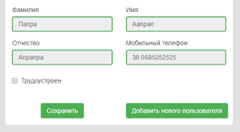


## Task description:

```csharp
public class User
{
	public string Surname { get; set; }
	public string Name { get; set; }
	public string Patronymic { get; set; }
	public string PhoneNumber { get; set; }
	public bool Employed { get; set; }
	public string OrganizationName { get; set; }
	public DateTime StartOnUtc { get; set; }
}
```

> - Создать новый MVC проект.

> - Создать метод действия для вывода списка пользователей.

> - Список пользователей на представление загружать асинхронно.

> - Для валидации использовать “ненавязчивую валидацию”.

> - Поля Surname, Name, Patronymic и PhoneNumber - обязательные.

> - Поля  OrganizationName и StartOnUtc обязательные(показывать) если выбран чекбокс Employed.

> - Для валидации этих полей необходимо создать кастомный атрибут.

> - Кнопка “Добавить” - по нажатию к существующему списку на странице показываем новый блок полей для заполнения.

> - В метод сохранения передаем весь список (существующие и добавленные).

> - Для хранения данных использовать SQL, ORM - EntityFramework.

> - Создать html helper для поля “Мобильный телефон”. 380 должен быть статический текст. все что после 0 - инпут. 
	Пример использования - @Html.PhoneNumberFor(m => m.Phone). Пример реализации - https://bistrozaim.ua/register.

> - Готовую работу выложить на Github.

> - Список должен быть редактируемый.

Пример:


